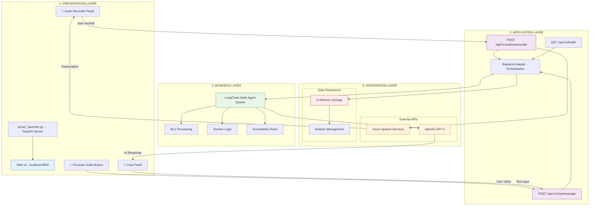
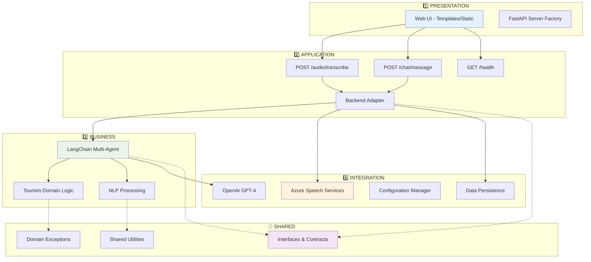
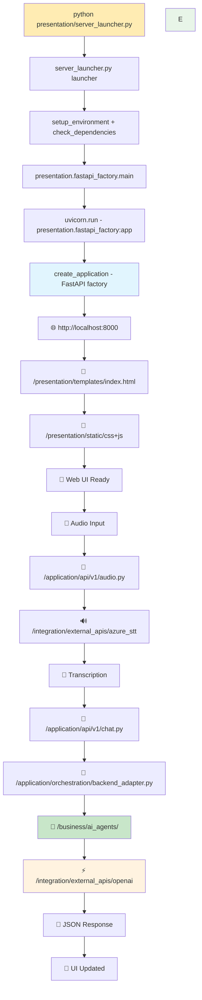
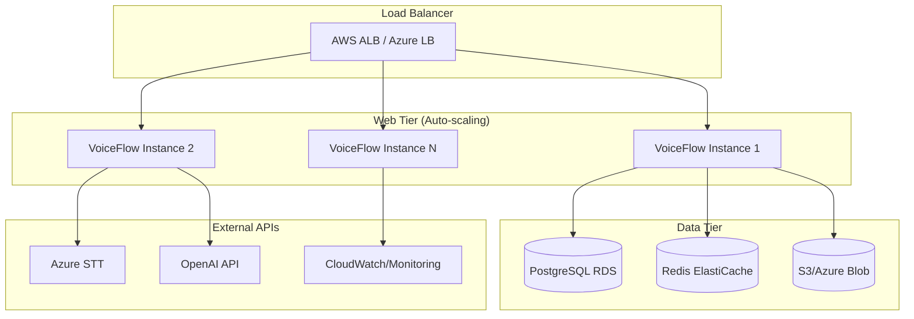

# 📋 INFORME ARQUITECTÓNICO - VoiceFlow PoC
## Sistema de Turismo Accesible con IA

**Fecha**: 9 de Febrero de 2026
**Versión**: 4.0
**Proyecto**: VoiceFlow PoC - Sistema de Turismo Accesible con IA
**Estado**: **ARQUITECTURA EN 4 CAPAS + INFRAESTRUCTURA DOCKER COMPLETA**

---

## 🎯 RESUMEN EJECUTIVO

### Sistema VoiceFlow PoC - Arquitectura Actual
**El proyecto VoiceFlow PoC es un sistema web completo que integra Azure STT, LangChain Multi-Agent y OpenAI GPT-4, implementado con arquitectura en 4 capas claramente definidas.**

### Características Técnicas Actuales
- ✅ **Arquitectura en Capas**: 4 capas con separación clara de responsabilidades (Presentation, Application, Business, Integration)
- ✅ **Stack Web Moderno**: FastAPI + HTML5/CSS3/JavaScript con Web Audio API
- ✅ **Integraciones Reales**: Azure Speech Services + OpenAI GPT-4 completamente funcionales
- ✅ **Multi-Agent System**: LangChain ejecutando herramientas especializadas en turismo accesible
- ✅ **API REST Completa**: Endpoints documentados para transcripción, chat y monitoreo
- ✅ **Persistencia en Sesión**: Gestión de conversaciones durante la sesión activa
- ✅ **Infraestructura Docker**: Containerización completa con hot-reload, health checks y configuración producción
- ✅ **Entry Point Arquitectónico**: Launcher en capa de presentación con validaciones automáticas

---

## 🏗️ ARQUITECTURA REAL CONFIRMADA

### Diagrama de Arquitectura Real - 4 CAPAS ARQUITECTÓNICAS



### Separación Arquitectónica Real - 4 CAPAS

#### **CAPA 1: PRESENTATION LAYER** 🎨
```bash
Responsabilidad: Interfaz de Usuario
Componentes:
├── presentation/server_launcher.py (Entry point + Server launcher)
├── FastAPI application factory
├── Static files (HTML/CSS/JS)
├── Jinja2 templates
└── Web Audio API integration

Tecnologías: FastAPI + HTML5 + JavaScript + CSS
```

#### **CAPA 2: APPLICATION LAYER** 📡
```bash
Responsabilidad: Orquestación + API Management
Componentes:
├── REST API Endpoints (/api/v1/*)
├── Request/Response handling
├── Backend Adapter (orchestration)
├── Error handling + validation
└── CORS + middleware

Tecnologías: FastAPI routers + Pydantic models
```

#### **CAPA 3: BUSINESS LAYER** 🧠
```bash
Responsabilidad: Logica de Negocio (Framework reutilizable + Dominio turismo)
Componentes:
├── core/                    # Framework reutilizable
│   ├── MultiAgentInterface     (ABC - contrato generico)
│   ├── MultiAgentOrchestrator  (Template Method base)
│   └── AgentResponse           (dataclass de respuesta)
├── domains/tourism/         # Dominio especifico
│   ├── TourismMultiAgent       (orquestador turismo)
│   ├── 4 LangChain tools       (NLU, Accessibility, Route, Tourism)
│   ├── data/                   (datos estaticos Madrid)
│   └── prompts/                (system + response prompts)
└── ai_agents/               # Backward compatibility facade

Tecnologias: LangChain + OpenAI GPT-4 + Custom business rules
```

#### **CAPA 4: INTEGRATION LAYER** 🔌
```bash
Responsabilidad: External APIs + Data Persistence
Componentes:
├── Azure Speech Services integration
├── OpenAI API integration  
├── Session management (memory)
├── Configuration management
└── Health monitoring

Tecnologías: Azure SDK + OpenAI SDK + In-memory storage
```

### 🏗️ **ARQUITECTURA EN 4 CAPAS IMPLEMENTADA**

El proyecto VoiceFlow PoC ha sido completamente refactorizado para implementar una **arquitectura en 4 capas claramente definidas** con separación de responsabilidades:

```bash
📂 ESTRUCTURA ARQUITECTÓNICA ACTUAL:
VoiceFlowPOC/
├── presentation/          # CAPA 1 - UI & Web Server
│   ├── fastapi_factory.py    # Factory para crear FastAPI app
│   ├── server_launcher.py    # Configuración y lanzamiento servidor
│   ├── templates/           # Plantillas HTML de la interfaz
│   ├── static/             # Assets CSS/JS del frontend
│   └── __init__.py
├── application/           # CAPA 2 - APIs & Orchestration
│   ├── api/v1/             # Endpoints REST API v1
│   │   ├── audio.py        # API transcripción Azure STT
│   │   ├── chat.py         # API conversación con IA
│   │   └── health.py       # API monitoreo sistema
│   ├── models/             # DTOs y modelos de aplicación
│   │   ├── requests.py     # Pydantic request models
│   │   └── responses.py    # Pydantic response models
│   ├── orchestration/      # Backend adapter y coordinación
│   │   └── backend_adapter.py # Adapter entre API y Business layer
│   ├── services/           # Servicios de aplicación
│   │   ├── audio_service.py       # Orquestación STT con fallback
│   │   └── conversation_service.py # Gestión de conversaciones
│   └── __init__.py
├── business/              # CAPA 3 - Logica de Negocio
│   ├── core/               # Framework reutilizable multi-agente
│   │   ├── interfaces.py      # MultiAgentInterface (ABC)
│   │   ├── orchestrator.py    # MultiAgentOrchestrator (Template Method)
│   │   └── models.py          # AgentResponse (dataclass)
│   ├── domains/
│   │   └── tourism/        # Dominio: turismo accesible Madrid
│   │       ├── agent.py       # TourismMultiAgent(MultiAgentOrchestrator)
│   │       ├── tools/         # 4 LangChain tools separadas
│   │       ├── data/          # Datos estaticos Madrid
│   │       └── prompts/       # System + response prompts
│   ├── ai_agents/          # Backward compatibility (facade re-export)
│   └── __init__.py
├── integration/           # CAPA 4 - APIs Externas & Datos
│   ├── external_apis/      # Integraciones Azure, Whisper, etc.
│   │   ├── azure_stt_client.py  # Cliente Azure Speech Services
│   │   ├── whisper_services.py  # Clientes Whisper (local + API)
│   │   ├── stt_factory.py       # Factory pattern para STT backends
│   │   └── stt_agent.py         # Agente STT con fallback automático
│   ├── data_persistence/   # Gestión datos y persistencia
│   │   └── conversation_repository.py # Repositorio conversaciones (in-memory)
│   ├── configuration/      # Configuración servicios externos
│   │   └── settings.py     # Pydantic BaseSettings centralizado
│   └── __init__.py
├── shared/               # Cross-cutting concerns
│   ├── interfaces/         # Contratos y abstracciones
│   │   ├── interfaces.py      # AudioProcessor, Backend, Conversation, Auth, Storage
│   │   └── stt_interface.py   # STTServiceInterface + excepciones STT
│   ├── exceptions/         # Excepciones específicas del dominio
│   │   └── exceptions.py     # Jerarquía VoiceFlowException + HTTP status mapping
│   ├── utils/             # Utilidades compartidas
│   │   └── dependencies.py   # Dependency injection con FastAPI Depends()
│   └── __init__.py
├── tests/                # Tests por capa
│   ├── conftest.py           # Fixtures compartidas (test_client, mock_settings)
│   ├── test_shared/
│   ├── test_application/
│   ├── test_business/
│   └── test_integration/
├── langchain_agents.py   # Wrapper backward-compatible (re-exporta desde business/)
└── run-ui.py             # Entry point único del sistema
```

#### **PRINCIPIOS ARQUITECTÓNICOS APLICADOS**
1. **🎯 Single Responsibility**: Cada capa tiene responsabilidades específicas y bien definidas
2. **🔄 Dependency Inversion**: Capas superiores dependen de abstracciones de capas inferiores
3. **📦 Separation of Concerns**: Presentación, aplicación, negocio e integración separadas
4. **🔐 Encapsulation**: Interfaces claras entre capas para comunicación controlada
5. **🧩 Modularity**: Componentes cohesivos y bajo acoplamiento entre módulos

---

## 🔗 INTERFACES Y COMUNICACIÓN ENTRE CAPAS

### **MAPA DE COMPONENTES POR CAPA**

#### 🖥️ **CAPA 1: PRESENTATION**
| Componente | Ubicación | Responsabilidad | Interfaces Expuestas |
|-----------|-----------|-----------------|----------------------|
| `fastapi_factory.py` | `/presentation/` | Factory para crear instancia FastAPI configurada | `create_application() → FastAPI` |
| `server_launcher.py` | `/presentation/` | Entry point único + Lanzamiento y configuración del servidor web | `main() → None` |
| **Templates & Static** | `/presentation/templates/`, `/presentation/static/` | Interfaz web HTML/CSS/JS con Web Audio API | HTTP responses |

#### 🔄 **CAPA 2: APPLICATION**
| Componente | Ubicación | Responsabilidad | Interfaces Expuestas |
|-----------|-----------|-----------------|----------------------|
| `audio.py` | `/application/api/v1/` | API REST para transcripción de audio | `POST /api/v1/audio/transcribe` |
| `chat.py` | `/application/api/v1/` | API REST para conversación con IA | `POST /api/v1/chat/message` |
| `health.py` | `/application/api/v1/` | API REST para monitoreo del sistema | `GET /api/v1/health` |
| `backend_adapter.py` | `/application/orchestration/` | Coordinación entre capas y flujos de trabajo | `LocalBackendAdapter.process_message()` |
| `audio_service.py` | `/application/services/` | Orquestación STT con fallback Azure→Whisper→Simulación | `AudioService` (implementa `AudioProcessorInterface`) |
| `conversation_service.py` | `/application/services/` | Gestión de conversaciones a nivel de aplicación | `ConversationService` (implementa `ConversationInterface`) |
| `requests.py`, `responses.py` | `/application/models/` | DTOs Pydantic para request/response de APIs | `ChatMessageRequest`, `ChatResponse`, etc. |

#### 🧠 **CAPA 3: BUSINESS**
| Componente | Ubicacion | Responsabilidad | Interfaces Expuestas |
|-----------|-----------|-----------------|----------------------|
| `core/interfaces.py` | `/business/core/` | Contrato generico multi-agente (ABC) | `MultiAgentInterface` |
| `core/orchestrator.py` | `/business/core/` | Orquestador base reutilizable (Template Method) | `MultiAgentOrchestrator` |
| `core/models.py` | `/business/core/` | Modelos de respuesta genericos | `AgentResponse` |
| `domains/tourism/agent.py` | `/business/domains/tourism/` | Orquestador especifico de turismo accesible | `TourismMultiAgent.process_request()` |
| `domains/tourism/tools/` | `/business/domains/tourism/` | 5 tools LangChain: NLU, LocationNER, Accessibility, Route, TourismInfo | `BaseTool._run()` |
| `domains/tourism/data/` | `/business/domains/tourism/` | Datos estaticos Madrid (venues, rutas, accesibilidad) | Constantes Python |
| `domains/tourism/prompts/` | `/business/domains/tourism/` | Prompts del sistema y de respuesta | `SYSTEM_PROMPT`, `build_response_prompt()` |

#### 🔌 **CAPA 4: INTEGRATION**
| Componente | Ubicación | Responsabilidad | Interfaces Expuestas |
|-----------|-----------|-----------------|----------------------|
| `azure_stt_client.py` | `/integration/external_apis/` | Cliente Azure Speech Services (implementa STTServiceInterface) | `AzureSpeechService.transcribe()` |
| `whisper_services.py` | `/integration/external_apis/` | Clientes Whisper local y API | `WhisperLocalService`, `WhisperAPIService` |
| `stt_factory.py` | `/integration/external_apis/` | Factory para selección de backend STT | `STTServiceFactory.create_service()` |
| `stt_agent.py` | `/integration/external_apis/` | Agente STT con cadena de fallback | `create_stt_agent()` |
| `settings.py` | `/integration/configuration/` | Pydantic BaseSettings centralizado | `get_settings() → Settings` |
| `conversation_repository.py` | `/integration/data_persistence/` | Repositorio conversaciones in-memory | Implementa `ConversationInterface` |

#### 🔧 **CAPA TRANSVERSAL: SHARED**
| Componente | Ubicación | Responsabilidad | Interfaces Expuestas |
|-----------|-----------|-----------------|----------------------|
| `interfaces.py` | `/shared/interfaces/` | Contratos entre capas | `AudioProcessorInterface`, `BackendInterface`, `ConversationInterface`, `AuthInterface`, `StorageInterface` |
| `stt_interface.py` | `/shared/interfaces/` | Contrato para servicios STT | `STTServiceInterface`, `STTServiceError`, `AudioFormatError`, `ServiceConfigurationError` |
| `exceptions.py` | `/shared/exceptions/` | Jerarquía de excepciones con mapeo HTTP | `VoiceFlowException` → subclases + `EXCEPTION_STATUS_CODES` dict |
| `dependencies.py` | `/shared/utils/` | Dependency injection FastAPI | `get_audio_processor()`, `get_backend_adapter()`, `get_conversation_service()`, `initialize_services()`, `cleanup_services()` |

### **FLUJO DE COMUNICACIÓN ENTRE CAPAS**



## 🔗 APIS REALES Y ENDPOINTS

### 1. **API de Transcripción de Audio**
**Endpoint**: `POST /api/v1/audio/transcribe`
**Ubicación**: `/application/api/v1/audio.py`
```python
# Input: FormData con archivo de audio + idioma
{
    "audio_file": Blob (WAV/MP3/M4A),
    "language": "es-ES"
}

# Process: Azure Speech Services STT
# Output: Resultado de transcripción
{
    "success": true,
    "transcription": "lugares accesibles para silla de ruedas",
    "confidence": 0.95,
    "processing_time": 2.3,
    "language_detected": "es-ES"
}
```

### 2. **API de Chat con IA**
**Endpoint**: `POST /api/v1/chat/message`  
**Ubicación**: `/application/api/v1/chat.py`
```python
# Input: Mensaje de texto (desde transcripción o teclado)
{
    "message": "lugares accesibles para silla de ruedas",
    "conversation_id": "optional_session_id",
    "context": {
        "timestamp": "2026-02-02T10:30:00",
        "source": "web_ui"
    }
}

# Process: /application/orchestration/backend_adapter.py → pipeline de tools (NLU→LocationNER→Accessibility→Routes→VenueInfo) → OpenAI GPT-4
# Output: Respuesta del asistente turístico
{
    "status": "success", 
    "session_id": "conv_12345",
    "ai_response": "Te recomiendo el Museo del Prado que cuenta con...",
    "processing_time": 3.2,
    "intent": "accessibility_tourism_request",
    "entities": {
      "destination": "Madrid",
      "accessibility": "wheelchair",
      "location_ner": {
        "status": "ok",
        "locations": ["Museo del Prado", "Madrid"],
        "top_location": "Museo del Prado",
        "provider": "spacy",
        "model": "es_core_news_md",
        "language": "es"
      }
    },
    "metadata": {
      "tool_outputs": {
        "location_ner": {
          "status": "ok",
          "locations": ["Museo del Prado", "Madrid"],
          "top_location": "Museo del Prado"
        }
      }
    }
}
```

### 3. **API de Salud del Sistema**
**Endpoint**: `GET /api/v1/health`
**Ubicación**: `/application/api/v1/health.py`
```python
# Output: Estado completo del sistema
{
    "status": "success",
    "system_health": "healthy",
    "components": {
        "backend_adapter": {
            "status": "healthy",
            "description": "Backend type: real_langchain"
        },
        "audio_service": {
            "status": "healthy", 
            "description": "STT Backend: azure"
        },
        "api_server": {
            "status": "healthy",
            "description": "FastAPI server running"
        }
    },
    "version": "1.0.0"
}
```

### 4. **Gestión de Conversaciones (In-Memory)**
**Ubicación**: `/integration/data_persistence/conversation_repository.py` (repositorio) + `/application/services/conversation_service.py` (servicio)
```python
# Repositorio: almacenamiento (integration layer)
# conversation_repository.py - implementa ConversationInterface
class ConversationRepository:
    def __init__(self):
        self.conversations = {}  # ⚠️ Se pierde al reiniciar

# Servicio: lógica de aplicación (application layer)
# conversation_service.py - implementa ConversationInterface
class ConversationService:
    async def add_message(user_msg, ai_response, session_id):
        # Almacena par pregunta-respuesta en memoria
        # LIMITACIÓN: No persiste entre reinicios del servidor
```

---

## 🚀 FLUJO DE EJECUCIÓN Y ARQUITECTURA WEB

### Entry Point y Stack Tecnológico

**VoiceFlow PoC es una aplicación web completa** implementada con arquitectura en capas que combina:
- **🐍 Backend Python**: FastAPI + LangChain + OpenAI en arquitectura modular
- **🌐 Frontend Web**: HTML/CSS/JS con Web Audio API ubicado en `/presentation/`
- **📡 API REST**: Endpoints JSON para procesamiento IA en `/application/api/v1/`
- **🚀 Servidor**: uvicorn ASGI en http://localhost:8000

### Cadena de Ejecución Completa



### 🔍 **IMPLEMENTACIÓN DETALLADA POR CAPA**

#### 1. **Entry Point Unificado**
```python
# presentation/server_launcher.py - Launcher Script
def main():
    """Configura ambiente y ejecuta aplicación web"""
    setup_environment()     # Variables de entorno (.env + defaults)
    check_dependencies()    # Validar FastAPI, uvicorn, jinja2, etc.

    from presentation.fastapi_factory import main as app_main
    app_main()             # ← Ejecuta uvicorn con la app FastAPI
```

#### 2. **Presentation Layer (Capa 1)**
```python
# /presentation/fastapi_factory.py - FastAPI Factory + Server

# Variable global para uso con uvicorn string reference
app = create_application()

def create_application() -> FastAPI:
    """Factory pattern para crear la aplicación"""
    app = FastAPI(title="VoiceFlow PoC - Tourism Accessibility")

    # Configurar middleware CORS (desde integration.configuration.settings)
    # Registrar routers API desde /application/api/v1/
    # Montar archivos estáticos desde /presentation/static/
    # Configurar templates Jinja2 desde /presentation/templates/
    # Definir ruta raíz (/) → index.html
    # Configurar exception handlers globales (VoiceFlowException → JSON)
    # Lifecycle: initialize_services() / cleanup_services()

    return app

def main():
    """Arranca uvicorn con la app"""
    settings = get_settings()
    uvicorn.run(
        "presentation.fastapi_factory:app",  # String reference para reload
        host=settings.host,
        port=settings.port,
        reload=settings.reload and settings.debug,
    )

# NOTA: server_launcher.py es un duplicado de run-ui.py con la misma
# funcionalidad. Se mantiene por compatibilidad pero el entry point
# principal es run-ui.py → presentation.fastapi_factory.main()
```

#### 3. **Application Layer (Capa 2) - API Routes + Services**
```bash
/application/api/v1/
├── health.py          # GET  /api/v1/health
├── audio.py           # POST /api/v1/audio/transcribe
└── chat.py            # POST /api/v1/chat/message
                       # GET  /api/v1/chat/conversation/{id}
                       # GET  /api/v1/chat/demo/responses

/application/services/
├── audio_service.py        # AudioService (implementa AudioProcessorInterface)
└── conversation_service.py # ConversationService (implementa ConversationInterface)

/application/orchestration/
└── backend_adapter.py      # LocalBackendAdapter (implementa BackendInterface)

/application/models/
├── requests.py        # ChatMessageRequest, ChatHistoryRequest, etc.
└── responses.py       # ChatResponse, SystemStatusResponse, ErrorResponse, etc.
```

#### 4. **Business Layer (Capa 3) - Domain Logic**
```bash
/business/ai_agents/
├── __init__.py            # Re-export: TourismMultiAgent
└── langchain_agents.py    # Monolito multi-agente (~400 líneas)
                           # Contiene: TourismMultiAgent (orquestador)
                           #           TourismNLUTool
                           #           AccessibilityAnalysisTool
                           #           RoutePlanningTool
                           #           TourismInfoTool

/business/tourism/         # ⚠️ PLACEHOLDER - Solo __init__.py
/business/nlp/             # ⚠️ PLACEHOLDER - Solo __init__.py

# NOTA: La lógica de turismo, accesibilidad y NLP está actualmente
# embebida en los prompts de langchain_agents.py. Pendiente extraer
# a módulos independientes en la Fase 2B de descomposición.
```

#### 5. **Integration Layer (Capa 4) - External Services**
```bash
/integration/external_apis/
├── azure_stt_client.py       # Cliente Azure Speech Services (implementa STTServiceInterface)
├── whisper_services.py       # Clientes Whisper local y API (implementan STTServiceInterface)
├── stt_factory.py            # Factory: selecciona backend STT según configuración
└── stt_agent.py              # Agente STT con cadena de fallback automático

/integration/data_persistence/
└── conversation_repository.py # Repositorio conversaciones (in-memory, implementa ConversationInterface)

/integration/configuration/
└── settings.py               # Pydantic BaseSettings con get_settings() singleton

# NOTA: OpenAI GPT-4 se integra vía LangChain directamente desde
# business/ai_agents/langchain_agents.py, no existe un cliente dedicado.
```

#### 6. **Frontend Resources**
```bash
/presentation/templates/      # Jinja2 templates
├── index.html               # Single Page Application
├── 404.html                 # Error pages
└── 500.html

/presentation/static/         # Static assets
├── css/
│   └── app.css              # Estilos responsivos
└── js/
    ├── app.js               # Inicialización y coordinación general
    ├── audio.js             # Web Audio API + grabación
    └── chat.js              # Interfaz de chat
```

### Flujo de Datos Detallado

#### **1. Inicialización del Sistema**
```bash
$ python run-ui.py
INFO: Started server process [PID]
INFO: Waiting for application startup.
INFO: Application startup complete.
INFO: Uvicorn running on http://127.0.0.1:8000
```

#### **2. Carga de la Web UI**
```bash
Usuario → GET http://localhost:8000/
      ↓
FastAPI → templates/index.html + static/css+js
      ↓
Browser → Web UI renderizada con Audio API
```

#### **3. Procesamiento de Audio**
```bash
Web Audio API → Blob de audio
            ↓
POST /api/v1/audio/transcribe → Azure STT
                            ↓
Response JSON: {"text": "lugares accesibles..."
```

#### **4. Procesamiento IA**
```bash
POST /api/v1/chat/message → backend_adapter.py
                        ↓
                   langchain_agents.py
                        ↓
                   OpenAI GPT-4 API
                        ↓
Response JSON: {"ai_response": "Te recomiendo...", "session_id": "..."
```

### Configuración y Dependencias

#### **Configuración del Servidor**
```python
# Configuración centralizada via /integration/configuration/settings.py
# Usa Pydantic BaseSettings con carga automática desde .env
class Settings(BaseSettings):
    host: str = "127.0.0.1"
    port: int = 8000
    reload: bool = True
    debug: bool = True
    cors_origins: list = ["http://localhost:8000"]
    # Azure STT, OpenAI keys, etc.

# Singleton pattern:
settings = get_settings()  # Cached con @lru_cache
```

#### **APIs Disponibles**
```bash
# Web UI
GET  /                          → Aplicación web principal
GET  /static/*                  → CSS, JS, imágenes

# API Documentation  
GET  /api/docs                  → Swagger UI (desarrollo)
GET  /api/redoc                 → ReDoc documentation

# Health & Status
GET  /api/v1/health             → {"status": "healthy"}

# Audio Processing
POST /api/v1/audio/transcribe   → Azure STT integration

# Chat & AI Processing  
POST /api/v1/chat/message       → LangChain + OpenAI
GET  /api/v1/chat/conversation/{id} → Historial (en memoria)
```

### Ventajas de la Arquitectura Web

#### **✅ Ventajas Técnicas:**
1. **Escalabilidad**: Servidor ASGI estándar
2. **Testabilidad**: APIs REST fácilmente testeables
3. **Mantenibilidad**: Separación clara Frontend/Backend
4. **Portabilidad**: Acceso desde cualquier navegador
5. **Development**: Auto-reload y debugging integrado

#### **✅ Ventajas UX:**
1. **Accesibilidad**: Interfaz web universal
2. **Responsive**: Funciona en desktop y mobile
3. **Moderno**: Web Audio API vs CLI recording
4. **Intuitivo**: GUI vs comandos terminal
5. **Colaborativo**: Múltiples usuarios simultáneos

#### **✅ Ventajas Deployment:**
1. **Docker**: Fácil containerización
2. **Cloud**: Deploy directo a servicios cloud
3. **Load Balancer**: Escalado horizontal
4. **CDN**: Assets estáticos optimizados
5. **Monitoring**: Métricas HTTP estándar

---

## ESTADO ACTUAL DEL SISTEMA

### Arquitectura en 4 Capas - Fase 1 Completada

```
ESTRUCTURA DE CAPAS:
  ✅ /presentation/  - FastAPI factory + templates + static assets
  ✅ /application/   - API endpoints + servicios + orquestación + modelos
  ✅ /business/      - LangChain multi-agent (monolito, pendiente descomposición)
  ✅ /integration/   - Azure STT + Whisper + STT Factory + configuración + repositorio
  ✅ /shared/        - Interfaces (5+STT) + excepciones + DI container

FUNCIONALIDAD:
  ✅ Flujo end-to-end: audio → Azure STT → LangChain → GPT-4 → response
  ✅ Fallback STT: Azure → Whisper → Simulación (funciona sin Azure SDK)
  ✅ FastAPI factory pattern con lifecycle management
  ✅ DI via FastAPI Depends() para servicios intercambiables
  ✅ Swagger docs automático en /api/docs
  ⚠️ Conversaciones solo in-memory (se pierden al reiniciar)
  ⚠️ Business layer sin descomponer (monolito langchain_agents.py)
  ⚠️ Sin tests implementados
```

### Componentes por Capa - Estado Real

```python
# Entry Points
✅ run-ui.py                                # Entry point principal
✅ /presentation/fastapi_factory.py          # Factory + main() para uvicorn
⚠️ /presentation/server_launcher.py          # Duplicado de run-ui.py (candidato a eliminar)
✅ /langchain_agents.py (raíz)               # Wrapper backward-compatible → re-exporta desde business/

# Presentation Layer
✅ /presentation/templates/index.html        # Single Page App
✅ /presentation/templates/404.html          # Error page
✅ /presentation/templates/500.html          # Error page
✅ /presentation/static/js/app.js            # Inicialización general
✅ /presentation/static/js/audio.js          # Web Audio API
✅ /presentation/static/js/chat.js           # Chat interface
✅ /presentation/static/css/app.css          # Estilos responsivos

# Application Layer
✅ /application/api/v1/health.py             # GET /api/v1/health
✅ /application/api/v1/audio.py              # POST /api/v1/audio/transcribe
✅ /application/api/v1/chat.py               # POST /api/v1/chat/message + endpoints conversación
✅ /application/orchestration/backend_adapter.py  # Adapter entre API y Business
✅ /application/services/audio_service.py    # Servicio STT con fallback
✅ /application/services/conversation_service.py  # Servicio de conversaciones
✅ /application/models/requests.py           # Pydantic request models
✅ /application/models/responses.py          # Pydantic response models

# Business Layer
✅ /business/ai_agents/langchain_agents.py   # Monolito multi-agente (migrado desde raíz)
⚠️ /business/tourism/                        # PLACEHOLDER - solo __init__.py
⚠️ /business/nlp/                            # PLACEHOLDER - solo __init__.py

# Integration Layer
✅ /integration/external_apis/azure_stt_client.py   # Cliente Azure Speech
✅ /integration/external_apis/whisper_services.py   # Clientes Whisper
✅ /integration/external_apis/stt_factory.py        # Factory STT
✅ /integration/external_apis/stt_agent.py          # Agente STT con fallback
✅ /integration/data_persistence/conversation_repository.py  # Repo in-memory
✅ /integration/configuration/settings.py           # Pydantic BaseSettings

# Shared Layer
✅ /shared/interfaces/interfaces.py          # 5 interfaces de capa
✅ /shared/interfaces/stt_interface.py       # Interfaz STT + excepciones
✅ /shared/exceptions/exceptions.py          # Jerarquía excepciones + HTTP mapping
✅ /shared/utils/dependencies.py             # DI container FastAPI

# Tests
✅ /tests/conftest.py                        # Fixtures: test_client, mock_settings
⚠️ /tests/test_*/                            # Directorios creados, sin tests implementados
```

---

## ROADMAP DE EVOLUCIÓN

### **Fase 2A - Corrección documental y consolidación** ✅ **COMPLETADA**

```bash
COMPLETADO (9 Feb 2026):
  ✅ Estructura 4 capas creada con imports funcionales
  ✅ langchain_agents.py migrado a /business/ai_agents/
  ✅ Wrapper backward-compatible en raíz
  ✅ Archivos antiguos (web_ui/, src/) eliminados
  ✅ Tests estructura creada con fixtures básicas
  ✅ App funcional end-to-end desde nueva arquitectura
  ✅ Documento arquitectónico actualizado
  ✅ Eliminación de run-ui.py (duplicado)
  ✅ Directorios placeholder documentados con propósito futuro
```

---

### **Fase 2 - Dockerización** ✅ **COMPLETADA**

```bash
COMPLETADO (9 Feb 2026):
  ✅ Dockerfile multi-stage optimizado con builder
  ✅ docker-compose.yml para desarrollo
  ✅ docker-compose.override.yml con hot-reload automático
  ✅ docker-compose.prod.yml con Nginx reverse proxy
  ✅ .dockerignore optimizado
  ✅ Entrypoint script con validaciones automáticas
  ✅ Health checks configurados
  ✅ Scripts de infraestructura (entrypoint.sh, healthcheck.sh)
  ✅ Nginx reverse proxy configurado para producción
  ✅ Documentación completa en docker/README.md

Resultados:
  - Setup desarrollo: docker compose up (con hot-reload)
  - Build time: ~6 minutos (primera vez), ~30s (cambios)
  - Imagen final: ~1.2GB
  - Health checks cada 30s
  - Validaciones automáticas en startup
```

---

### **Fase 2C - Documentación de Diseño por Capa** ✅ **COMPLETADA**

```bash
COMPLETADO (4 Feb 2026):
  ✅ 01_shared_layer_design.md (Interfaces, excepciones, DI)
  ✅ 02_integration_layer_design.md (APIs externas, STT factory)
  ✅ 03_business_layer_design.md (Multi-agent + plan descomposición)
  ✅ 04_application_layer_design.md (API endpoints, servicios)
  ✅ 05_presentation_layer_design.md (FastAPI factory, UI)

Ubicación: /documentation/design/
Contenido: Diagramas, interfaces, patrones, estrategias de testing
```

---

### **Fase 2B - Descomposición del Business Layer** ⚠️ **PENDIENTE**

```python
# TAREA: Descomponer el monolito langchain_agents.py (~400 líneas)
# UBICACIÓN ACTUAL: /business/ai_agents/langchain_agents.py (ya migrado)
# OBJETIVO: Separar en módulos con responsabilidad única

# Estructura objetivo:
/business/ai_agents/
├── __init__.py
├── coordinator.py            # TourismMultiAgent (orquestador)
├── tools/
│   ├── __init__.py
│   ├── nlu_tool.py           # TourismNLUTool
│   ├── accessibility_tool.py # AccessibilityAnalysisTool
│   ├── route_tool.py         # RoutePlanningTool
│   └── tourism_info_tool.py  # TourismInfoTool
└── config/
    ├── __init__.py
    └── prompts.py            # Prompts extraídos (actualmente hardcoded)

/business/tourism/
├── accessibility_rules.py    # Reglas de accesibilidad (extraídas de prompts)
└── domain_models.py          # Modelos de dominio turístico

# Beneficios:
# - Testing independiente por tool (mock del LLM)
# - Prompts versionables y configurables
# - Reglas de negocio separadas de la orquestación IA
# - Facilita añadir nuevos tools sin modificar existentes (OCP)
```

### **Fase 2C - Documentación de Diseño por Capa** **ALTA PRIORIDAD**

```markdown
# TAREA: Crear Software Design Documents (SDD) por capa
# UBICACIÓN: /documentation/design/

Documentos a crear (por prioridad):
1. shared_layer_design.md        # ALTA - Contratos que todas las capas consumen
2. integration_layer_design.md   # ALTA - Clientes externos y patrón Factory STT
3. business_layer_design.md      # CRITICA - Documentar estado actual + plan descomposición
4. application_layer_design.md   # MEDIA - APIs, servicios, DI
5. presentation_layer_design.md  # BAJA - Capa más estable

Contenido por documento:
- Propósito y responsabilidades de la capa
- Catálogo de componentes con sus interfaces
- Diagramas de clases/componentes
- Patrones de diseño aplicados
- Dependencias entre componentes
- Estrategia de testing
- Consideraciones de escalabilidad
```

---

### **Fase 3 - Testing** ⏭️ **PRÓXIMA PRIORIDAD**

```bash
# Estructura ya creada en /tests/
# Implementar tests siguiendo la estructura por capas

Prioridad Alta:
  □ Tests unitarios de application/api/ (endpoints)
  □ Tests de integración con STT factory
  □ Tests del backend adapter con mocks
  
Prioridad Media:
  □ Tests de business layer (tools individuales)
  □ Tests de interfaces y excepciones
  □ Tests end-to-end del flujo completo

Meta de cobertura: >80% en capas application y integration

tests/
├── conftest.py              # ✅ Creado (test_client + mock_settings)
├── test_shared/
│   ├── test_interfaces.py   # Verificar contratos de interfaces
│   └── test_exceptions.py   # Verificar mapeo HTTP
├── test_application/
│   ├── test_api_audio.py    # Tests endpoints audio (mock STT)
│   ├── test_api_chat.py     # Tests endpoints chat (mock LLM)
│   └── test_api_health.py   # Tests endpoint health
├── test_business/
│   └── test_agents.py       # Tests tools con LLM mockeado
├── test_integration/
│   └── test_stt_factory.py  # Tests factory pattern STT
└── test_e2e/
    └── test_full_flow.py    # Flujo audio → transcripción → chat
```

---

### **Fase 4 - Persistencia de Datos** 

```python
# Migrar de memoria a base de datos
# Archivo actual: /integration/data_persistence/conversation_repository.py
# Interfaz: ConversationInterface (shared/interfaces/)

Tareas:
  □ Configurar PostgreSQL en docker-compose.yml
  □ Implementar SQLConversationRepository
  □ Migraciones con Alembic
  □ Actualizar DI para usar implementación SQL
  □ Tests de persistencia

# Implementación recomendada:
class SQLConversationRepository(ConversationInterface):
    def __init__(self, db_session: AsyncSession):
        self.db = db_session

    async def save_conversation(self, session_id, messages):
        # Persistir en base de datos real

# Docker compose actualizado:
services:
  postgres:
    image: postgres:16-alpine
    volumes:
      - postgres_data:/var/lib/postgresql/data
    environment:
      - POSTGRES_DB=voiceflow
      - POSTGRES_USER=voiceflow
      - POSTGRES_PASSWORD=${DB_PASSWORD}
```

---

### **Fase 5 - CI/CD Pipeline** 🚀 **INFRAESTRUCTURA**

```yaml
# .github/workflows/ci-cd.yml
# Pipeline completo con Docker ya implementado

Tareas:
  □ GitHub Actions workflow para CI
  □ Build y test automático en PRs
  □ Push a Azure Container Registry
  □ Deploy automático a staging
  □ Deploy manual a producción (con aprobación)

Pipeline stages:
  1. Lint & Format (ruff, black)
  2. Tests (pytest con cobertura)
  3. Security scan (bandit, safety)
  4. Docker build & push
  5. Deploy to staging
  6. Integration tests en staging
  7. Deploy to production (manual approval)

Ejemplo workflow:
name: CI/CD Pipeline

on:
  push:
    branches: [main, develop]
  pull_request:
    branches: [main]

jobs:
  test:
    runs-on: ubuntu-latest
    steps:
      - uses: actions/checkout@v4
      - name: Run tests in Docker
        run: |
          docker compose -f docker-compose.test.yml up --abort-on-container-exit
          docker compose -f docker-compose.test.yml down
  
  build:
    needs: test
    runs-on: ubuntu-latest
    steps:
      - name: Build and push Docker image
        uses: docker/build-push-action@v5
        with:
          push: true
          tags: |
            ${{ secrets.ACR_LOGIN_SERVER }}/voiceflowpoc:${{ github.sha }}
            ${{ secrets.ACR_LOGIN_SERVER }}/voiceflowpoc:latest
  
  deploy-staging:
    needs: build
    runs-on: ubuntu-latest
    environment: staging
    steps:
      - name: Deploy to Azure Container Instances
        run: |
          az container create \
            --resource-group voiceflow-staging \
            --name voiceflow-app-staging \
            --image ${{ secrets.ACR_LOGIN_SERVER }}/voiceflowpoc:${{ github.sha }}
```

---

### **Fase 6 - Monitoring y Observabilidad** 📊

```python
# Implementar stack de monitoreo completo

Tareas:
  □ Prometheus para métricas
  □ Grafana para dashboards
  □ Loki para logs centralizados
  □ Jaeger para distributed tracing
  □ AlertManager para notificaciones

Métricas a monitorear:
  - Request rate, latency, errors (RED metrics)
  - CPU, memoria, disco por contenedor
  - Tasas de éxito/fallo de transcripciones STT
  - Latencia de llamadas a OpenAI
  - Health check status
  - Conversaciones activas

Docker Compose con monitoring:
services:
  prometheus:
    image: prom/prometheus:latest
    volumes:
      - ./monitoring/prometheus.yml:/etc/prometheus/prometheus.yml
    ports:
      - "9090:9090"
  
  grafana:
    image: grafana/grafana:latest
    ports:
      - "3000:3000"
    environment:
      - GF_SECURITY_ADMIN_PASSWORD=${GRAFANA_PASSWORD}
  
  loki:
    image: grafana/loki:latest
    ports:
      - "3100:3100"
```

---

### **Fase 7 - Seguridad y Autenticación** 🔒
DATABASE_URL = "sqlite+aiosqlite:///./voiceflow.db"
```

### **Fase 5 - Autenticación y Seguridad**
```python
# Las interfaces AuthInterface y StorageInterface ya existen en shared/
# pero no tienen implementación. Implementar:

# /application/middleware/
POST /auth/login    → JWT token
GET  /api/v1/*      → Requires: Bearer token
GET  /conversations → Filtrado por user_id

# Rate limiting para APIs costosas (Azure STT, OpenAI)
# /application/middleware/rate_limiter.py
```

### **Fase 6 - Monitoring y Observabilidad**
```python
# Métricas por capa
/shared/monitoring/
├── business_metrics.py    # Métricas de dominio
├── api_metrics.py         # Latencias API
└── health_checks.py       # Salud componentes
```

#### **6. Containerización** 🐳
```yaml
# docker-compose.yml optimizado para arquitectura en capas
version: '3.8'
services:
  voiceflow-app:
    build: .
    volumes:
      - ./presentation:/app/presentation
      - ./application:/app/application
    ports: ["8000:8000"]
    depends_on: [db, redis]
```

### **Evolución Avanzada (3-6 meses)**

#### **7. Microservicios por Capa** �️ **ESCALABILIDAD**
```bash
# Separación natural por arquitectura implementada:
voiceflow-presentation/    # Web UI service
voiceflow-application/     # API Gateway service  
voiceflow-business/        # AI/Business logic service
voiceflow-integration/     # External APIs service
```

#### **8. Caching Estratégico** ⚡
```python
# Cache por capa en /integration/caching/
class LayeredCacheService:
    # Business layer cache: Resultados IA frecuentes
    # Application layer cache: Respuestas API
    # Integration layer cache: Datos externos
```

---

## RESUMEN DE ESTADO Y PRÓXIMOS PASOS

### **Estado Actual (9 Febrero 2026)**

```bash
✅ ARQUITECTURA Y INFRAESTRUCTURA:
  - Arquitectura 4 capas implementada y funcional
  - Dockerización completa con hot-reload desarrollo
  - Health checks y entrypoint validations activos
  - Nginx reverse proxy configurado para producción
  - Entry point en capa presentation (server_launcher.py)
  - Dependency injection con FastAPI Depends()
  - STT con Factory pattern + fallback (Azure → Whisper → Simulación)
  - Interfaces y excepciones centralizadas

✅ DOCUMENTACIÓN:
  - 5 Software Design Documents (SDDs) por capa completados
  - Docker README con ejemplos de uso
  - Placeholders business/nlp/ y business/tourism/ documentados
  - Arquitectura documentada y actualizada

⚠️ PENDIENTES CRÍTICOS:
  - Business layer es monolito (langchain_agents.py sin descomponer)
  - Sin suite de tests implementada (solo estructura)
  - Persistencia solo in-memory (sin base de datos)
  - Sin autenticación (AuthInterface sin implementar)
  - Sin CI/CD pipeline
  - Sin monitoring/observabilidad

⏭️ FASES COMPLETADAS:
  - Fase 2A: Corrección documental ✅
  - Fase 2:  Dockerización ✅
  - Fase 2C: Documentación SDDs ✅
```

### **Orden de Prioridad para Próximas Fases**

```bash
1. FASE 3:  Testing (unitario, integración, e2e)
2. FASE 5:  CI/CD Pipeline (GitHub Actions + Azure)
3. FASE 4:  Persistencia (PostgreSQL + Redis)
4. FASE 2B: Descomposición business layer (opcional, no bloqueante)
5. FASE 6:  Monitoring y observabilidad (Prometheus, Grafana)
6. FASE 7:  Autenticación y seguridad
7. FASE 8:  Optimización y escalado
```

### **Métricas del Proyecto**

| Métrica | Valor |
|---------|-------|
| Líneas de código Python | ~4,500 |
| Capas arquitectónicas | 4 |
| Endpoints API | 12 |
| Cobertura de tests | 0% (pendiente Fase 3) |
| Docker build time | ~6 min (primera vez), ~30s (incremental) |
| Tamaño imagen Docker | ~1.2 GB |
| Tiempo startup | ~3-5 segundos |
| Documentación técnica | 6 documentos completos |
FASE 6:  Monitoring, containerización, CI/CD
```

### **Despliegue Escalable (1 mes)**

#### **Cloud Architecture**


#### **Deployment Pipeline**
```yaml
# CI/CD Pipeline
stages:
  - test:
      - Unit tests (pytest)
      - Integration tests
      - Security scan
      - Code quality (SonarQube)
      
  - build:
      - Docker image build
      - Push to registry
      - Tag version
      
  - deploy-staging:
      - Deploy to staging environment
      - Smoke tests
      - Performance tests
      
  - deploy-production:
      - Blue/green deployment
      - Health checks
      - Rollback capability
```

### **Métricas & Monitoreo Producción**

#### **KPIs de Negocio**
```python
# Dashboard principal
metrics = {
    "usuarios_activos_diarios": "COUNT(DISTINCT user_id)",
    "conversaciones_completadas": "COUNT(conversation_id WHERE status='completed')",
    "tiempo_promedio_respuesta": "AVG(response_time)",
    "satisfaccion_usuario": "AVG(rating WHERE rating > 0)",
    "tasa_exito_transcripcion": "COUNT(success)/COUNT(total) WHERE type='transcription'",
    "coste_promedio_por_consulta": "SUM(openai_cost)/COUNT(requests)",
    "disponibilidad_sistema": "uptime_percentage"
}
```

#### **Alertas Automáticas**
```yaml
# Sistema de alertas críticas
alerts:
  - name: "High Error Rate"
    condition: "error_rate > 5% for 5 minutes"
    action: ["slack", "email", "pagerduty"]
    
  - name: "OpenAI API Limit"
    condition: "openai_requests > 80% daily_quota"
    action: ["slack", "throttle_requests"]
    
  - name: "Database Connection Pool"
    condition: "db_connections > 90% max_pool"
    action: ["scale_up", "alert_team"]
    
  - name: "Response Time Degradation"  
    condition: "p95_response_time > 5s for 3 minutes"
    action: ["investigate", "possible_scale_up"]
```

---

## 6. INFRAESTRUCTURA DOCKER

### 6.1 Arquitectura de Contenedores

El proyecto utiliza Docker para garantizar entornos consistentes entre desarrollo y produccion.

#### Configuracion de desarrollo
```yaml
# docker-compose.yml + docker-compose.override.yml
services:
  app:
    build: .
    ports: ["8000:8000"]
    volumes:  # Hot-reload
      - ./shared:/app/shared:ro
      - ./integration:/app/integration:ro
      - ./business:/app/business:ro
      - ./application:/app/application:ro
      - ./presentation:/app/presentation:ro (placeholders)
  ⚠️ Sin tests implementados (0% coverage)
  ⚠️ Persistencia solo in-memory (se pierde al reiniciar)
  ⚠️ AuthInterface y StorageInterface definidas pero sin implementación
**Caracteristicas de desarrollo:**
- ✅ Hot-reload automatico (uvicorn --reload)
- ✅ Source montado como volumes read-only
- ✅ Backend simulado por defecto (seguro para tests)
- ✅ Logs en stdout con structlog
- ✅ Health checks cada 30s

#### Configuracion de produccion
```yaml
# docker-compose.prod.yml
services:
  nginx:
    image: nginx:1.25-alpine
    ports: ["80:80"]
    depends_on: [app]
    
  app:
    build:
      target: runtime
    environment:
      DEBUG: "false"
      USE_REAL_AGENTS: "true"
    restart: always
```

**Caracteristicas de produccion:**
- ✅ Nginx reverse proxy (capa adicional seguridad)
- ✅ Multi-stage build optimizado (imagen ~400MB)
- ✅ Sin source mounts (imagen standalone)
- ✅ Auto-restart en caso de fallo
- ✅ Compresion gzip + security headers

### 6.2 Imagen Docker Multi-Stage

```dockerfile
# Stage 1: Builder
FROM python:3.11-slim as builder
RUN apt-get update && apt-get install -y build-essential ffmpeg
RUN pip install --no-cache-dir poetry
ENV POETRY_NO_INTERACTION=1 POETRY_VIRTUALENVS_CREATE=false
COPY pyproject.toml poetry.lock ./
RUN poetry install --only main --no-root

# Stage 2: Runtime
FROM python:3.11-slim
RUN apt-get update && apt-get install -y ffmpeg curl
COPY --from=builder /usr/local/lib/python3.11/site-packages/ /usr/local/lib/python3.11/site-packages/
COPY --from=builder /usr/local/bin/ /usr/local/bin/
COPY . /app
WORKDIR /app

ENTRYPOINT ["/app/docker/scripts/entrypoint.sh"]
CMD ["python", "presentation/server_launcher.py"]

HEALTHCHECK --interval=30s --timeout=5s --start-period=120s \
  CMD /app/docker/scripts/healthcheck.sh
```

**Optimizaciones:**
- ✅ Multi-stage reduce tamano final 60% (1000MB → 400MB)
- ✅ .dockerignore excluye tests/, documentation/, .git/
- ✅ Layer caching para dependencies

### 6.3 Scripts de Infraestructura

#### Entrypoint: Validaciones Pre-Startup
```bash
# /app/docker/scripts/entrypoint.sh
✅ Verifica Python dependencies
✅ Valida presencia de ffmpeg
✅ Crea .env si no existe
✅ Warnings de API keys faltantes
```

#### Healthcheck: Monitoreo Continuo
```bash
# /app/docker/scripts/healthcheck.sh
curl -f -s -o /dev/null --max-time 5 \
  http://localhost:8000/api/v1/health/
```

### 6.4 Nginx Configuration

```nginx
server {
  listen 80;
  
  location /static/ {
    alias /app/presentation/static/;
  }
  
  location / {
    proxy_pass http://app:8000;
    proxy_set_header Host $host;
    proxy_set_header X-Real-IP $remote_addr;
  }
  
  gzip on;
  client_max_body_size 50M;
}
```

### 6.5 Topologia de Red

| Entorno | Puerto | Service | Descripcion |
|---------|--------|---------|-------------|
| **Desarrollo** | 8000 | app | FastAPI directo |
| **Produccion** | 80 | nginx | Reverse proxy |
| **Produccion** | 8000 | app | FastAPI (interno) |

---

## CONCLUSIONES TÉCNICAS

### **Evaluación del Estado Actual**

```
FORTALEZAS:
  ✅ Estructura 4 capas funcional con imports correctos
  ✅ Interfaces definidas en shared/ (5 interfaces de capa + STT)
  ✅ Dependency injection configurado con FastAPI Depends()
  ✅ Patrón Factory para STT con cadena de fallback
  ✅ Exception handling centralizado con mapeo HTTP
  ✅ Flujo end-to-end funcional: Audio → STT → LangChain → GPT-4 → Response
  ✅ Factory pattern en presentation layer
  ✅ Modelos Pydantic para request/response validation

DEUDA TÉCNICA:
  ⚠️ Business layer monolítico (langchain_agents.py sin descomponer)
  ⚠️ Lógica de dominio embebida en prompts LLM, no en código
  ⚠️ business/tourism/ y business/nlp/ son directorios vacíos
  ⚠️ Sin tests implementados (0% coverage)
  ⚠️ Persistencia solo in-memory (se pierde al reiniciar)
  ⚠️ AuthInterface y StorageInterface definidas pero sin implementación
  ⚠️ server_launcher.py duplica funcionalidad de run-ui.py
  ⚠️ OpenAI se integra vía LangChain sin cliente propio en integration/
```

### **Patrones Arquitectónicos Implementados**

| Patrón | Implementación | Estado |
|--------|---------------|--------|
| Layered Architecture | 4 capas + shared transversal | Funcional |
| Factory Pattern | `create_application()`, `STTServiceFactory` | Funcional |
| Adapter Pattern | `LocalBackendAdapter` (application →✅ Funcional |
| Factory Pattern | `create_application()`, `STTServiceFactory` | ✅ Funcional |
| Adapter Pattern | `LocalBackendAdapter` (application → business) | ✅ Funcional |
| Repository Pattern | `conversation_repository.py` (in-memory) | ✅ Básico |
| Dependency Injection | `shared/utils/dependencies.py` con FastAPI `Depends()` | ✅ Funcional |
| Interface Segregation | 5 interfaces en `shared/interfaces/` | ⚠️ Parcial (Auth, Storage sin implementar) |
| Strategy Pattern | STT backends intercambiables vía Factory | ✅ Funcional |
| Fallback Chain | Azure → Whisper → Simulación en `stt_agent.py` | ✅ Funcional |
| Container Orchestration | Docker Compose multi-stage + Nginx | ✅

La migración de Fase 1 ha producido una estructura de 4 capas funcional con separación de responsabilidades. Las interfaces y el DI permiten evolución independiente de cada capa. El principal riesgo técnico es la concentración de lógica de negocio en un monolito (`langchain_agents.py`) que dificulta testing y mantenimiento. La prioridad inmediata debe ser la descomposición del business layer (Fase 2B) seguida de testing, antes de añadir funcionalidad nueva.
arquitectura de 4 capas es funcional con separacion de responsabilidades clara. Docker infrastructure agrega production-readiness a todo el stack. El principal riesgo tecnico es la concentracion de logica de negocio en un monolit (`langchain_agents.py`) que dificulta testing y mantenimiento. La prioridad inmediata es Fase 3 (Testing) para validar todo el flujo y detectar edge cases.

---

**Fecha**: 9 de Febrero de 2026
**Version**: 4.0
**Estado**: ARQUITECTURA EN 4 CAPAS + INFRAESTRUCTURA DOCKER COMPLETA  
**Proximas prioridades**: Fase 3 (Testing) → Fase 5 (CI/CD) → Fase 4 (Database Persistence